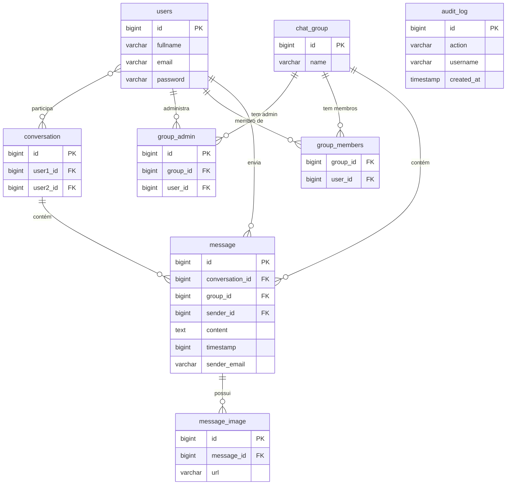

# 💬 LinkTalk

## 1. Sobre o Projeto

**LinkTalk** é uma aplicação de chat em tempo real que permite aos usuários trocarem mensagens privadas e em grupos. O sistema suporta envio de texto e imagens, gerenciamento de grupos de conversa (criação, renomeação, adição e remoção de membros), e controle de acesso baseado em papéis (administradores de grupo).

A aplicação foi construída com foco em comunicação em tempo real via **WebSocket**, autenticação segura com **JWT (RS256)**, e auditoria de ações no banco de dados.

### Funcionalidades principais

- 📝 Cadastro e autenticação de usuários com senha criptografada (bcrypt)
- 🔐 Autenticação via JWT com chave assimétrica RS256
- 💬 Conversas privadas (1 a 1) em tempo real via WebSocket
- 👥 Grupos de chat com suporte a múltiplos membros
- 🛡️ Controle de administradores de grupo
- 🖼️ Envio de imagens nas conversas
- 📋 Auditoria de todas as ações dos usuários no banco de dados
- 🗑️ Exclusão de mensagens e conversas

---

## 2. Como Executar

### Pré-requisitos

- [Docker](https://www.docker.com/) e Docker Compose
- [Java 17+](https://adoptium.net/)
- [Node.js 18+](https://nodejs.org/) e npm

---

### 2.1 Banco de Dados (PostgreSQL via Docker)

O banco de dados roda em um container Docker. O arquivo `init.sql` na raiz do projeto é executado automaticamente na primeira inicialização, criando todas as tabelas e sequences necessárias.

```bash
# Na raiz do projeto
sudo docker compose up -d
```

Isso irá subir um container PostgreSQL 15 com as seguintes configurações:

| Parâmetro  | Valor              |
|------------|--------------------|
| Host       | `localhost`        |
| Porta      | `5432`             |
| Database   | `linktalk`         |
| Usuário    | `admin`            |
| Senha      | `goat@123`         |

Para parar o banco:

```bash
sudo docker compose down
```

---

### 2.2 Backend (Quarkus)

O backend é uma aplicação **Quarkus** gerenciada pelo Maven Wrapper. Certifique-se de que o banco de dados já está rodando antes de iniciar o backend.

```bash
cd backend

# Dar permissão de execução ao script (apenas na primeira vez)
chmod +x mvnw

# Iniciar o servidor em modo desenvolvimento (hot reload)
./mvnw quarkus:dev
```

O servidor iniciará em: **`http://localhost:8081`**

> **Nota:** Em modo `quarkus:dev`, alterações no código são refletidas automaticamente sem necessidade de reiniciar o servidor.

---

### 2.3 Frontend (React + Vite)

O frontend é uma aplicação **React** com Vite.

```bash
cd frontend

# Instalar dependências (apenas na primeira vez)
npm install

# Iniciar o servidor de desenvolvimento
npm run dev
```

O frontend estará disponível em: **`http://localhost:5173`**

---

### Ordem recomendada para subir o ambiente

```
1. sudo docker compose up -d      ← Banco de dados
2. cd backend && ./mvnw quarkus:dev ← Backend (porta 8081)
3. cd frontend && npm run dev       ← Frontend (porta 5173)
```

---

## 3. Arquitetura

### 3.1 Visão Geral

```
┌─────────────────────────────────────────────────────────────┐
│                         Frontend                            │
│              React 18 + Vite + Redux + Axios                │
│                    http://localhost:5173                     │
│                                                             │
│  ┌──────────┐  ┌──────────┐  ┌──────────┐  ┌───────────┐  │
│  │  Login   │  │ Cadastro │  │ ChatRoom │  │  Modals   │  │
│  └──────────┘  └──────────┘  └──────────┘  └───────────┘  │
└──────────────────────┬──────────────────┬───────────────────┘
                       │  REST (HTTP)     │  WebSocket (WS)
                       │  Axios + JWT     │  SockJS/STOMP
                       ▼                  ▼
┌─────────────────────────────────────────────────────────────┐
│                         Backend                             │
│              Quarkus 3.13 + JAX-RS + Hibernate ORM          │
│                    http://localhost:8081                     │
│                                                             │
│  ┌────────────────────────────────────────────────────────┐ │
│  │  Controllers (JAX-RS)                                  │ │
│  │  /user  /conversation  /message  /group  /images       │ │
│  └────────────────────────┬───────────────────────────────┘ │
│  ┌────────────────────────┼───────────────────────────────┐ │
│  │  WebSockets            │                               │ │
│  │  /conversation/{id}/{token}   /group/{id}/{token}      │ │
│  └────────────────────────┼───────────────────────────────┘ │
│  ┌────────────────────────▼───────────────────────────────┐ │
│  │  Business Objects (BO)                                 │ │
│  │  UserBO  ConversationBO  MessageBO  GroupBO  ImageBO   │ │
│  └────────────────────────┬───────────────────────────────┘ │
│  ┌────────────────────────▼───────────────────────────────┐ │
│  │  DAOs + Entities (Hibernate ORM)                       │ │
│  └────────────────────────┬───────────────────────────────┘ │
└───────────────────────────┼─────────────────────────────────┘
                            │  JDBC (PostgreSQL Driver)
                            ▼
┌─────────────────────────────────────────────────────────────┐
│                  PostgreSQL 15 (Docker)                     │
│                    localhost:5432/linktalk                   │
└─────────────────────────────────────────────────────────────┘
```

---

### 3.2 Arquitetura do Backend

O backend segue uma arquitetura em camadas:

| Camada        | Pacote                    | Responsabilidade                                      |
|---------------|---------------------------|-------------------------------------------------------|
| **Controller**| `org.acme.controller`     | Expõe endpoints REST, valida JWT, chama BOs           |
| **BO**        | `org.acme.model.bo`       | Regras de negócio, orquestração das operações         |
| **DAO**       | `org.acme.model.dao`      | Acesso ao banco de dados via Hibernate ORM            |
| **Entity**    | `org.acme.model.entity`   | Mapeamento das tabelas do banco de dados              |
| **DTO**       | `org.acme.model.dto`      | Objetos de transferência de dados (request/response)  |
| **Socket**    | `org.acme.socket`         | Endpoints WebSocket para chat em tempo real           |
| **Exception** | `org.acme.exception`      | Tratamento customizado de erros                       |

#### Endpoints REST

| Método | Endpoint                            | Descrição                                 | Auth |
|--------|-------------------------------------|-------------------------------------------|------|
| POST   | `/user/register`                    | Cadastro de novo usuário                  | ❌   |
| POST   | `/user/login`                       | Login, retorna token JWT                  | ❌   |
| GET    | `/user/verify-email/{email}`        | Verifica se e-mail já está cadastrado     | ❌   |
| GET    | `/user/contactsByUserId/{id}`       | Lista contatos do usuário                 | ✅   |
| GET    | `/user/email/{email}`               | Busca usuário por e-mail                  | ✅   |
| GET    | `/user/{userId}/groups`             | Lista grupos do usuário                   | ✅   |
| POST   | `/conversation`                     | Inicia conversa privada                   | ✅   |
| DELETE | `/conversation/{id}`                | Remove conversa                           | ✅   |
| GET    | `/message/conversation/{id}`        | Busca mensagens de uma conversa           | ✅   |
| GET    | `/message/group/{id}`               | Busca mensagens de um grupo               | ✅   |
| DELETE | `/message/{id}`                     | Deleta uma mensagem                       | ✅   |
| POST   | `/group`                            | Cria um novo grupo                        | ✅   |
| DELETE | `/group/{id}`                       | Remove um grupo                           | ✅   |
| GET    | `/group/{id}/members`               | Lista membros do grupo                    | ✅   |
| PUT    | `/group/{id}/add-user`              | Adiciona usuário ao grupo                 | ✅   |
| PUT    | `/group/{id}/remove-user`           | Remove usuário do grupo                   | ✅   |
| PUT    | `/group/{id}/updateName`            | Atualiza nome do grupo                    | ✅   |
| GET    | `/images/{imageName}`               | Serve uma imagem armazenada               | ❌   |

#### WebSocket Endpoints

| Endpoint                                    | Descrição                                      |
|---------------------------------------------|------------------------------------------------|
| `ws://localhost:8081/conversation/{id}/{token}` | Chat privado em tempo real (texto + imagem)|
| `ws://localhost:8081/group/{id}/{token}`        | Chat de grupo em tempo real (texto + imagem)|

---

### 3.3 Arquitetura do Frontend

O frontend é uma **Single Page Application (SPA)** construída com React 18 e gerenciamento de estado via Redux.

| Tecnologia         | Uso                                              |
|--------------------|--------------------------------------------------|
| **React 18**       | Interface de usuário com componentes funcionais  |
| **Vite 5**         | Bundler e servidor de desenvolvimento            |
| **React Router 6** | Roteamento entre páginas                        |
| **Redux + Thunk**  | Gerenciamento de estado global                   |
| **Axios**          | Requisições HTTP para a API REST                 |
| **SockJS + STOMP** | Conexão WebSocket com o backend                 |

#### Rotas

| Rota        | Componente       | Acesso     |
|-------------|------------------|------------|
| `/`         | `Login`          | Público    |
| `/login`    | `Login`          | Público    |
| `/cadastro` | `Cadastro`       | Público    |
| `/chatRoom` | `ChatRoom`       | Privado 🔐 |

#### Estrutura de arquivos

```
frontend/src/
├── api/
│   └── api.js              # Instância Axios com interceptor JWT
├── component/
│   ├── login.jsx           # Tela de login
│   ├── cadastro.jsx        # Tela de cadastro
│   ├── chatRoom.jsx        # Tela principal do chat
│   ├── PrivateRoute.jsx    # HOC para proteger rotas autenticadas
│   └── modals/
│       ├── createGroupModal.jsx       # Criar novo grupo
│       ├── addUserGroupModal.jsx      # Adicionar usuário ao grupo
│       ├── removeUserGroups.jsx       # Remover usuário do grupo
│       ├── editNameGroupModel.jsx     # Renomear grupo
│       ├── deleteGroupModal.jsx       # Confirmar exclusão do grupo
│       ├── deleteConversationModal.jsx# Confirmar exclusão de conversa
│       ├── deleteMessageModal.jsx     # Confirmar exclusão de mensagem
│       └── exitGroupModal.jsx         # Confirmar saída do grupo
├── redux/
│   ├── store.js            # Configuração da Redux store
│   ├── rootReducer.js      # Combinação de reducers
│   ├── userActions.js      # Action creators
│   └── userReducer.js      # Reducer de estado do usuário
├── App.jsx                 # Componente raiz com rotas
├── main.jsx                # Entry point (ReactDOM + Redux Provider)
└── index.css               # Estilos globais
```

---

### 3.4 Diagrama das Tabelas do Banco de Dados



#### Descrição das Tabelas

| Tabela           | Descrição                                                                 |
|------------------|---------------------------------------------------------------------------|
| `users`          | Usuários da plataforma, com senha armazenada em hash bcrypt               |
| `conversation`   | Conversas privadas entre dois usuários (`user1_id` e `user2_id`)          |
| `chat_group`     | Grupos de chat com nome definido                                          |
| `group_admin`    | Relacionamento de administradores de um grupo (constraint única por par)  |
| `group_members`  | Membros de um grupo; chave primária composta `(group_id, user_id)`        |
| `message`        | Mensagens enviadas; pode pertencer a uma conversa **ou** a um grupo       |
| `message_image`  | Imagens associadas a mensagens, armazenadas no filesystem do servidor     |
| `audit_log`      | Registro auditável de todas as ações realizadas pelos usuários            |

---

### 3.5 Tecnologias Utilizadas

#### Backend

| Tecnologia             | Versão  | Descrição                              |
|------------------------|---------|----------------------------------------|
| Quarkus                | 3.13.3  | Framework Java nativo/reativo          |
| Java                   | 17      | Linguagem de programação               |
| Hibernate ORM          | —       | Mapeamento objeto-relacional           |
| SmallRye JWT           | —       | Autenticação com JWT RS256             |
| Jakarta WebSocket      | 2.0.0   | Comunicação em tempo real              |
| PostgreSQL JDBC Driver | —       | Conexão com banco de dados             |
| jBCrypt                | 0.4     | Hash de senhas com bcrypt              |
| Jackson                | —       | Serialização/deserialização JSON       |

#### Frontend

| Tecnologia     | Versão  | Descrição                                   |
|----------------|---------|---------------------------------------------|
| React          | 18.3    | Biblioteca de interface de usuário           |
| Vite           | 5.4     | Build tool e servidor de desenvolvimento     |
| React Router   | 6.26    | Roteamento client-side                      |
| Redux          | 5.0     | Gerenciamento de estado global              |
| Redux Thunk    | 3.1     | Middleware para actions assíncronas          |
| Axios          | 1.7     | Cliente HTTP                                |
| SockJS         | 1.6     | Fallback WebSocket                          |
| STOMP.js       | 2.3     | Protocolo de mensageria sobre WebSocket     |

#### Infraestrutura

| Tecnologia     | Versão | Descrição                          |
|----------------|--------|------------------------------------|
| PostgreSQL     | 15     | Banco de dados relacional          |
| Docker         | —      | Containerização do banco de dados  |
