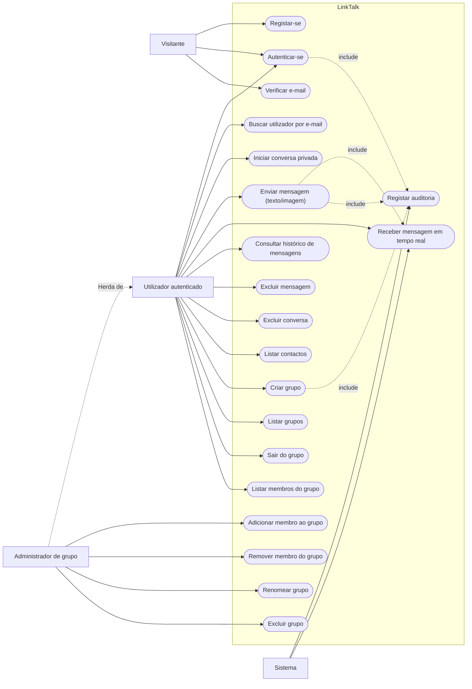
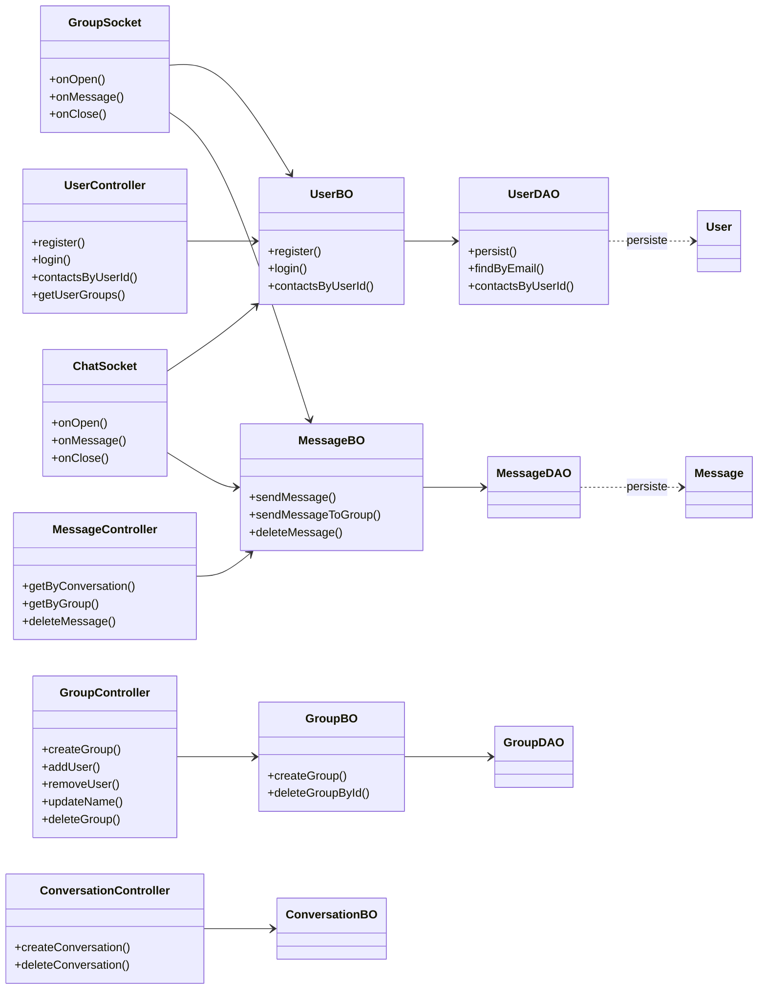
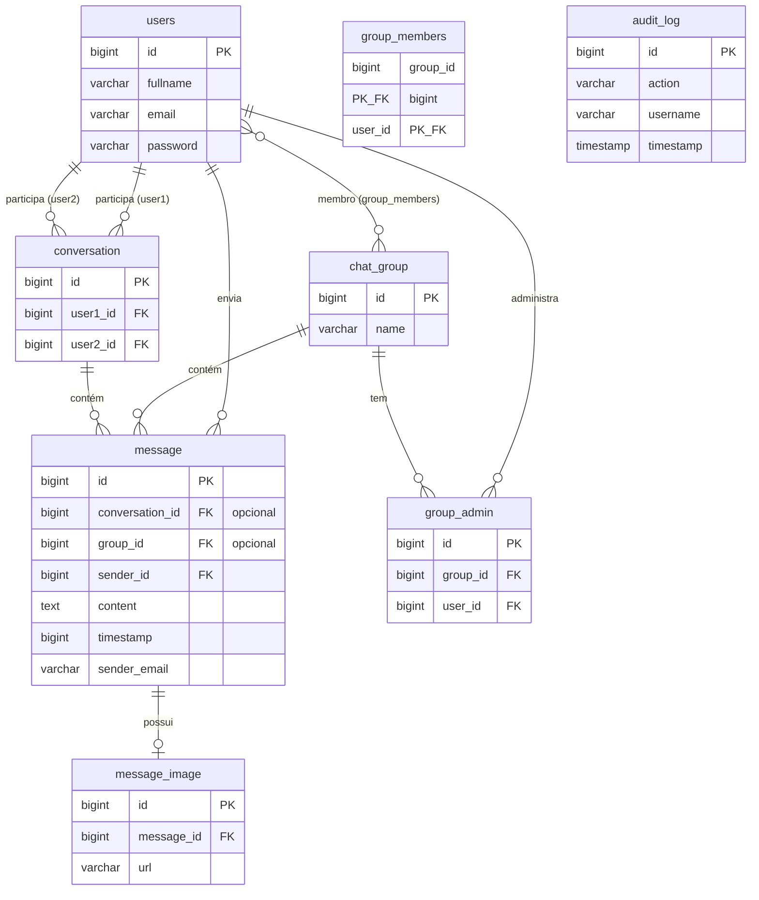

# Documento de Requisitos — LinkTalk

**Disciplina:** Qualidade de Software  
**Versão:** 1.1  
**Data:** Maio/2026  
**Sistema:** LinkTalk — aplicação de chat em tempo real  

| | |
|---|---|
| **Integrantes do grupo** | 
_João Victor Nascimento dos Santos-20231080080121,_
_Matias Monteiro Dantas-20221080080051._ |
| **Professor(a)** | 
_Daniel Canedo_ |

---

## Índice

1. [Descrição Geral do Sistema](#1-descrição-geral-do-sistema)
2. [Diagrama de Caso de Uso](#2-diagrama-de-caso-de-uso)
3. [Diagrama de Classes](#3-diagrama-de-classes)
4. [DER — Diagrama Entidade-Relacionamento](#4-der--diagrama-entidade-relacionamento)
5. [Dicionário de Dados](#5-dicionário-de-dados)
6. [Referências ao Código e Banco de Dados](#6-referências-ao-código-e-banco-de-dados)

---

## 1. Descrição Geral do Sistema

### 1.1 Nome do sistema

**LinkTalk**

### 1.2 Objetivo

O LinkTalk é uma aplicação web de mensagens instantâneas que permite comunicação **privada (1:1)** e **em grupo**, com suporte a texto e imagens, autenticação segura e registro de auditoria das operações. O objetivo é oferecer um ambiente simples e em tempo real para troca de mensagens entre utilizadores registados, com gestão de grupos e controlo de administradores.

### 1.3 Público-alvo

| Perfil | Descrição |
|--------|-----------|
| **Utilizador final** | Pessoas que precisam trocar mensagens de forma rápida (estudantes, equipas de projeto, pequenos grupos de trabalho). |
| **Administrador de grupo** | Utilizador membro de um grupo com permissões extras: adicionar/remover membros, renomear o grupo e excluir o grupo. |
| **Equipe de desenvolvimento / QA** | Responsável pela manutenção, testes e avaliação de qualidade do sistema nas etapas da disciplina. |

O sistema destina-se a utilizadores com acesso à internet, familiarizados com interfaces web, que necessitam de chat síncrono sem instalar software adicional além do navegador.

### 1.4 Funcionalidades principais

| ID | Funcionalidade | Descrição |
|----|----------------|-----------|
| RF01 | Cadastro de utilizador | Registo com nome, e-mail e senha (validação e hash bcrypt). |
| RF02 | Autenticação | Login com JWT (RS256) e sessão no cliente. |
| RF03 | Verificação de e-mail | Consulta se o e-mail já está cadastrado (cadastro). |
| RF04 | Conversa privada | Iniciar chat 1:1 entre dois utilizadores. |
| RF05 | Mensagens em tempo real | Envio/receção via WebSocket (texto e imagem). |
| RF06 | Histórico de mensagens | Listagem de mensagens por conversa ou grupo. |
| RF07 | Grupos de chat | Criar grupo, definir nome e membros iniciais. |
| RF08 | Gestão de membros | Administrador adiciona ou remove utilizadores do grupo. |
| RF09 | Renomear grupo | Administrador altera o nome do grupo. |
| RF10 | Sair do grupo | Membro remove-se do grupo. |
| RF11 | Exclusão | Apagar mensagem, conversa ou grupo (conforme permissões). |
| RF12 | Busca de utilizador | Pesquisar utilizador por e-mail para iniciar conversa. |
| RF13 | Auditoria | Registo automático de ações relevantes na tabela `audit_log`. |
| RF14 | Imagens | Upload de imagem em mensagem (armazenamento em disco + URL). |
| RF15 | Listar membros do grupo | Consultar utilizadores que pertencem a um grupo (`GET /group/{id}/members`). |

### 1.5 Requisitos não funcionais (resumo)

| ID | Requisito |
|----|-----------|
| RNF01 | Comunicação em tempo real via WebSocket. |
| RNF02 | Autenticação com JWT assimétrico (RS256). |
| RNF03 | Senhas armazenadas com hash bcrypt. |
| RNF04 | Persistência em PostgreSQL 15. |
| RNF05 | API REST documentada no README do projeto. |

### 1.6 Tecnologias

- **Frontend:** React 18, Vite, Redux, Axios, WebSocket nativo  
- **Backend:** Quarkus 3.13, Hibernate ORM, JAX-RS, Jakarta WebSocket  
- **Banco de dados:** PostgreSQL 15 (Docker)  
- **Infraestrutura:** Docker Compose

---

## 2. Diagrama de Caso de Uso

### 2.1 Atores

| Ator | Descrição |
|------|-----------|
| **Visitante** | Utilizador não autenticado; pode registar-se e fazer login. |
| **Utilizador autenticado** | Utilizador com sessão válida (JWT); usa chat, grupos e busca. |
| **Administrador de grupo** | Utilizador autenticado com flag de administração em um grupo específico. |
| **Sistema** | Registra auditoria e processa mensagens em tempo real. |

### 2.2 Diagrama



### 2.3 Descrição resumida dos casos de uso

| Caso de uso | Ator principal | Descrição |
|-------------|------------------|-----------|
| Registar-se | Visitante | Cria conta com validação de dados e senha criptografada. |
| Autenticar-se | Visitante / Utilizador | Valida credenciais e retorna token JWT. |
| Enviar mensagem | Utilizador autenticado | Envia texto ou imagem via WebSocket; persiste no banco. |
| Criar grupo | Utilizador autenticado | Cria grupo, adiciona membros e define criador como admin. |
| Adicionar membro ao grupo | Administrador de grupo | Inclui novos utilizadores no grupo. |
| Excluir grupo | Administrador de grupo | Remove grupo e dados associados (cascade). |
| Registar auditoria | Sistema | Grava ação, utilizador e data/hora em `audit_log`. |

---

## 3. Diagrama de Classes

O diagrama representa as **classes de domínio (entidades)**, a **camada de negócio (BO)**, **acesso a dados (DAO)**, **controladores REST** e **endpoints WebSocket**, conforme implementado no backend Quarkus.

### 3.1 Diagrama de classes (domínio e persistência)

```mermaid
classDiagram
    direction TB

    class User {
        -Long id
        -String fullName
        -String email
        -String password
        +getId() Long
        +getFullName() String
        +getEmail() String
    }

    class Conversation {
        -Long id
        +getId() Long
        +getUser1() User
        +getUser2() User
    }

    class Group {
        -Long id
        -String name
        +getId() Long
        +getName() String
        +getMembers() List~User~
    }

    class GroupAdmin {
        -Long id
        +getGroup() Group
        +getUser() User
    }

    class Message {
        -Long id
        -String content
        -Long timestamp
        -String senderEmail
        +getConversation() Conversation
        +getGroup() Group
        +getSender() User
    }

    class Image {
        -Long id
        -String url
        +getMessage() Message
    }

    class AuditLog {
        -Long id
        -String action
        -String username
        -LocalDateTime timestamp
    }

    User "1" --> "0..*" Conversation : participa (user1)
    User "1" --> "0..*" Conversation : participa (user2)
    User "1" --> "0..*" Message : envia
    Conversation "1" --> "0..*" Message : contém
    Group "1" --> "0..*" Message : contém
    Group "1" --> "0..*" GroupAdmin : possui
    User "1" --> "0..*" GroupAdmin : administra
    Group "1" o-- "0..*" User : membros (N:M)
    Message "1" --> "0..1" Image : possui
```

**Nota sobre herança:** o modelo de domínio não utiliza generalização entre entidades. A herança aparece apenas na camada de exceções (`InvalidLoginException` estende exceções da API) e no uso de interfaces do Jakarta EE pelos componentes Quarkus — padrão do framework, não regra de negócio do chat.

**Legenda de relacionamentos:**

| Relacionamento | Tipo UML | Cardinalidade |
|----------------|----------|---------------|
| User ↔ Conversation | Associação | 1 utilizador participa de 0..* conversas |
| User ↔ Group (via `group_members`) | Associação N:M | N membros em M grupos |
| User ↔ GroupAdmin | Associação | 1 utilizador pode administrar 0..* grupos |
| Conversation/Group → Message | Agregação/Associação | 1 chat contém 0..* mensagens |
| Message → Image | Composição | 0..1 imagem por mensagem |

### 3.2 Diagrama de classes (camadas da aplicação)



### 3.3 Principais classes e responsabilidades

| Classe | Pacote | Responsabilidade |
|--------|--------|------------------|
| `User` | `model.entity` | Representa utilizador da plataforma. |
| `Conversation` | `model.entity` | Conversa privada entre dois utilizadores. |
| `Group` | `model.entity` | Grupo de chat com nome e membros. |
| `Message` | `model.entity` | Mensagem em conversa ou grupo. |
| `UserBO` | `model.bo` | Regras de negócio de utilizador e JWT. |
| `MessageBO` | `model.bo` | Envio, listagem e exclusão de mensagens. |
| `GroupBO` | `model.bo` | Criação e gestão de grupos. |
| `UserDAO` | `model.dao` | Acesso JDBC/JPA às tabelas de utilizador. |
| `ChatSocket` | `socket` | WebSocket de conversa privada. |
| `GroupSocket` | `socket` | WebSocket de grupo. |

---

## 4. DER — Diagrama Entidade-Relacionamento

### 4.1 Diagrama



### 4.2 Cardinalidades e regras

| Relacionamento | Cardinalidade | Regra de negócio |
|----------------|---------------|------------------|
| `users` — `conversation` | 1 : N (em cada papel user1/user2) | Uma conversa liga exatamente dois utilizadores. |
| `users` — `chat_group` | N : M (`group_members`) | Um grupo tem vários membros; um membro pode estar em vários grupos. |
| `users` — `group_admin` | N : M (com unicidade par) | Par (group_id, user_id) único; define administradores. |
| `conversation` — `message` | 1 : N | Mensagem privada referencia `conversation_id`. |
| `chat_group` — `message` | 1 : N | Mensagem de grupo referencia `group_id`. |
| `message` | — | Deve ter `conversation_id` **ou** `group_id` (não ambos obrigatórios no modelo físico). |
| `message` — `message_image` | 1 : 0..1 | Imagem opcional associada à mensagem. |
| `audit_log` | — | Independente; registra eventos do sistema. |

### 4.3 Script de criação

O modelo físico está implementado no arquivo:

- **`/init.sql`** (raiz do repositório)

---

## 5. Dicionário de Dados

Convenções: **PK** = chave primária | **FK** = chave estrangeira | **UK** = único

### 5.1 Tabela `users`

| Campo | Tipo | Nulo | Chave | Descrição |
|-------|------|------|-------|-----------|
| `id` | `BIGINT` | Não | PK | Identificador único do utilizador (sequence `users_id_seq`). |
| `fullname` | `VARCHAR(255)` | Não | — | Nome completo exibido no chat. |
| `email` | `VARCHAR(255)` | Não | UK* | E-mail de login; único na aplicação (validado no código; ver nota abaixo). |

\* **Nota:** o `init.sql` não declara `UNIQUE` em `email`; a unicidade é garantida pela regra de negócio em `UserBO.register()`. Recomenda-se adicionar `UNIQUE (email)` no script em versões futuras.
| `password` | `VARCHAR(255)` | Não | — | Hash da senha (bcrypt); nunca armazenada em texto puro. |

### 5.2 Tabela `conversation`

| Campo | Tipo | Nulo | Chave | Descrição |
|-------|------|------|-------|-----------|
| `id` | `BIGINT` | Não | PK | Identificador da conversa privada. |
| `user1_id` | `BIGINT` | Não | FK → `users.id` | Primeiro participante da conversa. |
| `user2_id` | `BIGINT` | Não | FK → `users.id` | Segundo participante da conversa. |

### 5.3 Tabela `chat_group`

| Campo | Tipo | Nulo | Chave | Descrição |
|-------|------|------|-------|-----------|
| `id` | `BIGINT` | Não | PK | Identificador do grupo. |
| `name` | `VARCHAR(255)` | Não | — | Nome exibido do grupo de chat. |

### 5.4 Tabela `group_members`

| Campo | Tipo | Nulo | Chave | Descrição |
|-------|------|------|-------|-----------|
| `group_id` | `BIGINT` | Não | PK, FK → `chat_group.id` | Grupo ao qual o utilizador pertence. |
| `user_id` | `BIGINT` | Não | PK, FK → `users.id` | Utilizador membro do grupo. |

### 5.5 Tabela `group_admin`

| Campo | Tipo | Nulo | Chave | Descrição |
|-------|------|------|-------|-----------|
| `id` | `BIGINT` | Não | PK | Identificador do registro de administração. |
| `group_id` | `BIGINT` | Não | FK → `chat_group.id` | Grupo administrado. |
| `user_id` | `BIGINT` | Não | FK → `users.id` | Utilizador com papel de administrador no grupo. |

**Restrição:** `UNIQUE (group_id, user_id)` — um utilizador não pode ser admin duplicado no mesmo grupo.

### 5.6 Tabela `message`

| Campo | Tipo | Nulo | Chave | Descrição |
|-------|------|------|-------|-----------|
| `id` | `BIGINT` | Não | PK | Identificador da mensagem. |
| `conversation_id` | `BIGINT` | Sim | FK → `conversation.id` | Conversa privada (preenchido em chat 1:1). |
| `group_id` | `BIGINT` | Sim | FK → `chat_group.id` | Grupo (preenchido em chat de grupo). |
| `sender_id` | `BIGINT` | Não | FK → `users.id` | Utilizador que enviou a mensagem. |
| `content` | `TEXT` | Não | — | Conteúdo textual da mensagem (pode ser vazio se houver imagem). |
| `timestamp` | `BIGINT` | Não | — | Data/hora de envio em milissegundos (epoch). |
| `sender_email` | `VARCHAR(255)` | Não | — | E-mail do remetente (desnormalizado para exibição/auditoria). |

### 5.7 Tabela `message_image`

| Campo | Tipo | Nulo | Chave | Descrição |
|-------|------|------|-------|-----------|
| `id` | `BIGINT` | Não | PK | Identificador da imagem. |
| `url` | `VARCHAR(255)` | Não | — | URL de acesso à imagem no servidor (`/images/{nome}`). |
| `message_id` | `BIGINT` | Sim | FK → `message.id` | Mensagem à qual a imagem está vinculada. |

### 5.8 Tabela `audit_log`

| Campo | Tipo | Nulo | Chave | Descrição |
|-------|------|------|-------|-----------|
| `id` | `BIGINT` | Não | PK | Identificador do registro de auditoria. |
| `action` | `VARCHAR(255)` | Não | — | Nome da ação executada (ex.: `LOGIN_REQUEST`). |
| `username` | `VARCHAR(255)` | Não | — | E-mail ou identificador do utilizador relacionado ao evento. |
| `timestamp` | `TIMESTAMP` | Não | — | Data e hora em que a ação foi registrada. |

### 5.9 Sequences (geradores de ID)

| Sequence | Tabela associada |
|----------|------------------|
| `users_id_seq` | `users` |
| `conversation_id_seq` | `conversation` |
| `group_chat_id_seq` | `chat_group` |
| `group_admin_id_seq` | `group_admin` |
| `message_id_seq` | `message` |
| `message_image_id_seq` | `message_image` |
| `audit_log_id_seq` | `audit_log` |

---

## 6. Referências ao Código e Banco de Dados

### 6.1 Estrutura do repositório

```
linktalk-main/
├── init.sql                 # Script de criação do banco (PostgreSQL)
├── docker-compose.yml       # Container do PostgreSQL
├── README.md                # Instruções de execução
├── docs/
│   └── Documento-de-Requisitos.md   # Este documento
├── backend/                 # API Quarkus (Java 17)
└── frontend/                # Interface React (Vite)
```

### 6.2 Instruções básicas de execução

1. Subir o banco: `docker compose up -d` (na raiz do projeto).  
2. Backend: `cd backend` → `mvnw.cmd quarkus:dev` (Windows) ou `./mvnw quarkus:dev` (Linux/macOS).  
3. Frontend: `cd frontend` → `npm install` → `npm run dev`.  
4. Acessar: `http://localhost:5173` (frontend) — API em `http://localhost:8081`.

Detalhes completos, portas e credenciais padrão estão no **README.md** da raiz.

